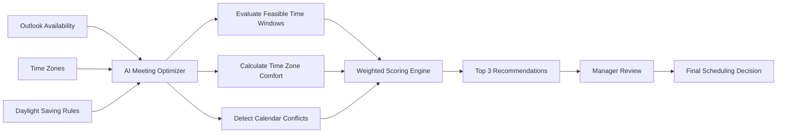

# Global Team Meeting Optimizer
 
AI-assisted decision support for scheduling recurring meetings across globally distributed teams.
 
---
 
# Situation
 
Global teams often struggle to schedule recurring meetings across multiple regions.
 
Managers must manually:
 
- Check Outlook calendars
- Convert time zones
- Account for daylight saving changes
- Evaluate attendee availability
- Balance regional inconvenience
- Compare multiple scheduling options
 
The process is time-consuming, difficult to repeat consistently, and often produces subjective results.
 
---
 
# Business Question
 
> Can AI identify the fairest feasible meeting time faster and more consistently than a human manager?
 
---
 
# What We Assumed
 
We assumed:
 
- Outlook availability is reliable
- Team members can reasonably participate between 5:00 AM and 11:00 PM local time
- Time-zone inconvenience can be evaluated objectively
- AI can recommend options, while managers retain decision authority
 
---
 
# Architecture
 

 
---
 
# How AI Creates Value
 
The AI performs the analysis, not the decision.
 
### AI Responsibilities
 
- Evaluate candidate meeting times
- Convert local times
- Handle daylight saving changes
- Detect scheduling conflicts
- Calculate fairness scores
- Rank meeting options
 
### Human Responsibilities
 
- Review recommendations
- Consider business priorities
- Make final scheduling decisions
 
---
 
# Weighted Scoring Model
 
The recommendation score is fully transparent.
 
```text
Weighted Score
 
=
(Time-Zone Comfort × 60%)
 
+
 
(Outlook Availability × 40%)
```
 
### Time-Zone Comfort
 
Measures how reasonable the meeting time is for each attendee.
 
- 100 = standard working hours
- Lower score = closer to the awake-hour boundary
- Outside awake hours = rejected
 
### Outlook Availability
 
Measures attendee availability.
 
- 100 = all required attendees available
- Lower values reflect conflicts
 
---
 
# Known / Interpreted / Important / Unknown
 
## Known
 
- Time zones
- DST rules
- Outlook availability
- Meeting duration
- Awake-hour constraints
 
## Interpreted
 
- Fairness score
- Time-zone comfort score
- Ranking of meeting options
 
## Important
 
- Required attendee coverage
- Scheduling conflicts
- Extreme early-morning or late-evening meetings
 
## Unknown
 
- Personal preferences
- Travel schedules
- Regional holidays
- Participant willingness to attend outside working hours
- Business importance of specific attendees
 
---
 
# Read Me
 
## Purpose
 
This prototype demonstrates how AI can support a common operational decision:
 
> Selecting the best recurring meeting time for a global team.
 
Instead of replacing the manager, the AI removes the manual analysis effort and presents ranked recommendations.
 
---
